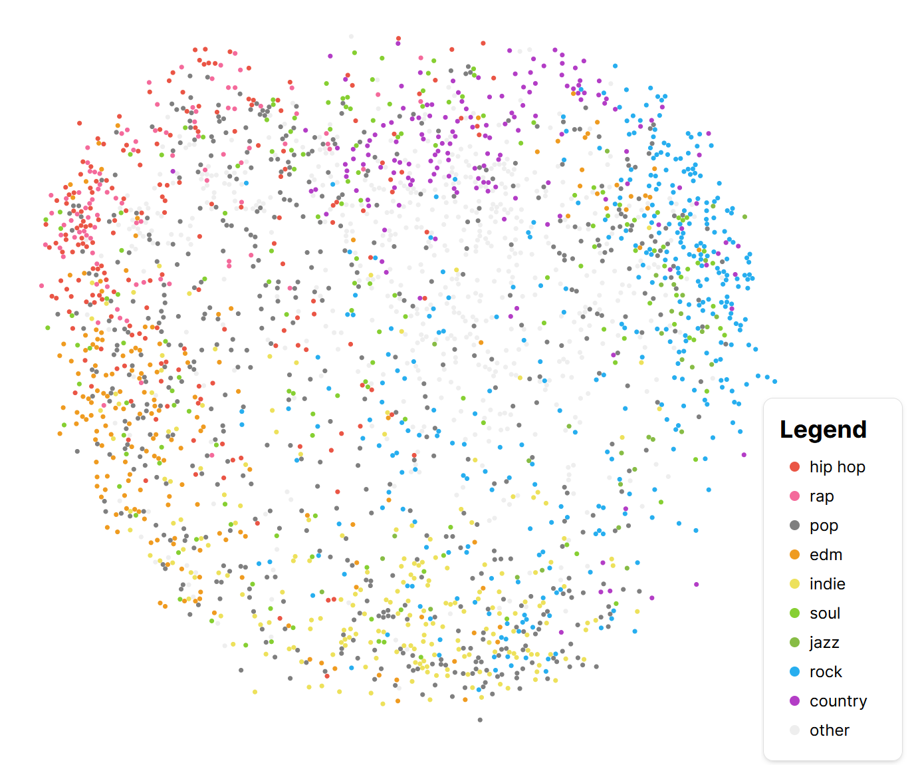

# Spotify Artist Map

This project uses principal component analysis to analyze the [Spotify Million Playlist Dataset](https://www.aicrowd.com/challenges/spotify-million-playlist-dataset-challenge) and produce a map of artists. For details, read our article: https://spotify-pca-map.netlify.app

The full interactive is available at https://spotify-pca-map.netlify.app/interactive.

## Project structure

`site/` contains all frontend code.

This base directory contains data analysis scripts in the form of Jupyter notebooks.
