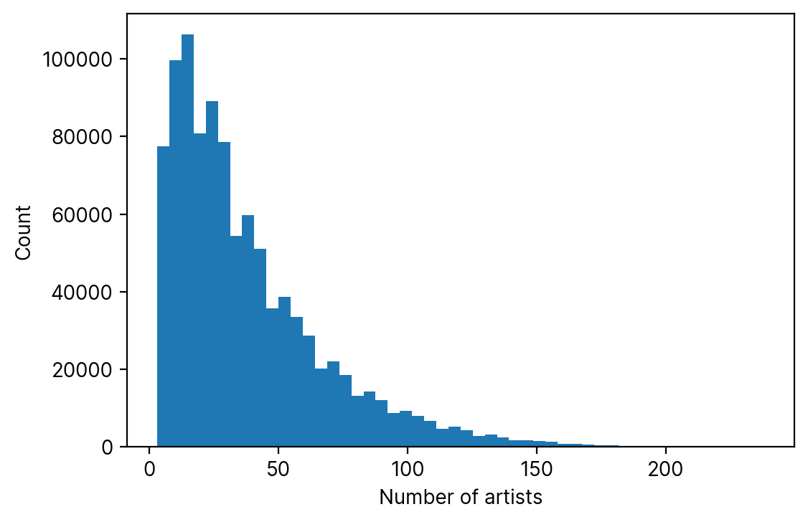
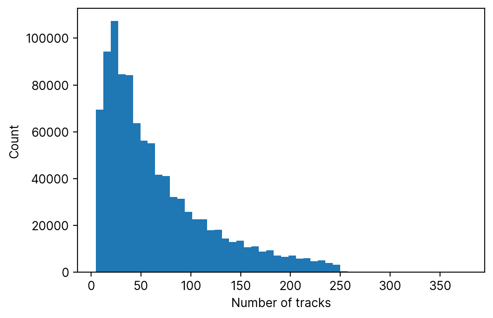
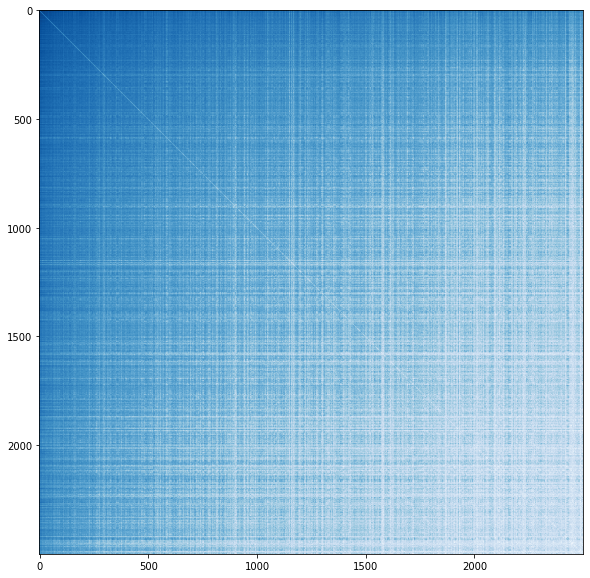

# Mapping Spotify Artists

	
By <a href="https://womogenes.github.io" target="_blank">William Y. Feng</a> and <a href="https://tinyurl.com/ceciliasun" target="_blank">Cecilia Sun</a>

	
<i>View the source code for this project <a href="https://github.com/womogenes/spotify-final" target="_blank">here</a>.</i>

## Introduction

Music streaming service [Spotify](https://www.spotify.com/) transformed music listening when it first launched in 2008, and has since become the go-to method for streaming and listening to new music.
Gone were the days of CDs and cassettes; users could now listen to high-quality music at the touch of a button.

<!---
One of the greatest conveniences Spotify had to offer, however, was the ability to quickly create and add to playlists.
--->

The rise of Spotify and other online streaming servers has fundamentally changed the way we listen to music.
Whereas, in the past, individual songs had to be played as part of a complete album by a singular artist, either on vinyl or, later, via cassette tapes, streaming services have made it easier for listeners to mix-and-match individual songs by different artists to curate and share completely personal and original playlists; in short, playlists have become the default way to listen to music.

The content in Spotify playlists can vary widely.
Some Spotify users group music by genre, such as in this k-pop girl group playlist:

  
<iframe style="border-radius:12px" src="https://open.spotify.com/embed/playlist/2DLAaotcOJPMecaaZtrgtk?utm_source=generator" width="75%" height="152" frameBorder="0" allowfullscreen="" allow="autoplay; clipboard-write; encrypted-media; fullscreen; picture-in-picture" loading="lazy"></iframe>

Others group songs according to a certain set of "vibes", such as in this "chill vibes" playlist:

<iframe style="border-radius:12px" src="https://open.spotify.com/embed/playlist/4PAzvpUoDjE1hsLyYxbxNx?utm_source=generator" width="75%" height="152" frameBorder="0" allowfullscreen="" allow="autoplay; clipboard-write; encrypted-media; fullscreen; picture-in-picture" loading="lazy"></iframe>

Yet others create playlists in order to set the mood for an activity, whether it be a dance party playlist, a workout playlist, or a "soft pop/rock" playlist to "take the edge off" of labor \& delivery (!?):

<iframe style="border-radius:12px" src="https://open.spotify.com/embed/playlist/37i9dQZF1DXe13FP72mxNn?utm_source=generator" width="75%" height="152" frameBorder="0" allowfullscreen="" allow="autoplay; clipboard-write; encrypted-media; fullscreen; picture-in-picture" loading="lazy"></iframe>

Others are silly, such as this user-created playlist that takes you along on an emotional journey making banana bread:

<iframe style="border-radius:12px" src="https://open.spotify.com/embed/playlist/2k9WGCD9GxTUsdYtIDnZhG?utm_source=generator" width="75%" height="152" frameBorder="0" allowfullscreen="" allow="autoplay; clipboard-write; encrypted-media; fullscreen; picture-in-picture" loading="lazy"></iframe>

or this playlist consisting of 343 hours of "Satan's Saxophones":

<iframe style="border-radius:12px" src="https://open.spotify.com/embed/playlist/5YuogqMDKbD8KSXn71MGdt?utm_source=generator" width="75%" height="152" frameBorder="0" allowfullscreen="" allow="autoplay; clipboard-write; encrypted-media; fullscreen; picture-in-picture" loading="lazy"></iframe>

In sum, playlists are generally organized with a central theme in mind. Therefore, tracks on the same user-created playlists can be expected to have some sort of commonality.

## About the Dataset

Spotify's [Million Playlist Dataset](https://www.aicrowd.com/challenges/spotify-million-playlist-dataset-challenge) contains a million user-created Spotify playlists from between January 2010 and October 2017.

On average, playlists contain 66 tracks from 38 distinct artists and 50 different albums.
Here's a visualization of the distribution of playlist length across all the playlists:

And a visualization of the number of distinct artists represented per playlist:

Both distributions have a right skew, but more curiously they are not normal distributions but rather decrease exponentially in frequency for greater numbers of artists and tracks.

## Artist Interactions

Across the one million playlists, there are a total of 287742 artists represented.
For our analysis, however, we decided to focus on the top 2500 artists as determined by the number of occurrences of any of their songs across all playlists.

We were interested in the concept of "artist proximity" -- in other words, how often two artists appeared in user-created playlists together.
To rigorize this concept, we defined the "Artist Interaction Score" (AIS) between two artists to be

$$
	\operatorname{AIS}(A,B) = \ln\left(\sum_{p\text{ in playlists}}(\text{number of tracks by }A\text{ in }p)(\text{number of tracks by }B\text{ in }p)\right).
$$

In other words, the more times two artists both have many songs in the same playlist, the higher their Artist Interaction Score will be.

We then created a 2500 by 2500 matrix containing artist interaction scores for each of the 6250000 ordered pairs of artists. After ordering the rows and columns in order of artist popularity and coloring cells by value (darker cells

<!---
talk about how popular artists are generally put with popular artists
--->

## PCA (Principal Component Analysis)

Principal Component Analysis (PCA) is a technique for analyzing and visualizing high-dimensional data, such as our artist interaction matrix. Broadly speaking, the method attempts to increase data interprability by reducing the number of dimensions (usually to just 2 dimensions) while still preserving as much information as possible.

### Some Technical Mathematical Details
<!--
explain pca.
-->

## Limitations of our Analysis
One limitation of our analysis is that defines its metrics of artist popularity and artist interaction through user-created *playlists*. This creates certain genres of music that are potentially underrepresented within the data: for instance, 
songs from genres such as "album rock" are better listened to in the context of other songs from that album, while songs in more recently-released albums are more frequently written with playlist inclusion in mind: these songs are potentially overrepresented in our data. 
It is difficult, however, to know for sure how severely these issues are manifested in our data and analysis because of the difficulty of finding objective measures of the already-vague notions of "artist popularity" and "artist interactions" and due to the sheer size of the data. 

Another limitation of our analysis comes from the limitations of PCA itself. Our implementation of PCA projects high-dimension data onto a two-dimensional grid, but the interpretation of the axes is unclear.

## The PCA Map
Here's the PCA map of the top 2500 artists in its entirety, with artists colored by genre. 

<!---
some general trends in the map
pca is really good at grouping things. we're still not sure what the axes could be representing
--->

## PCA map in all its glory

Finally, here is the interactive PCA map in all its glory.
