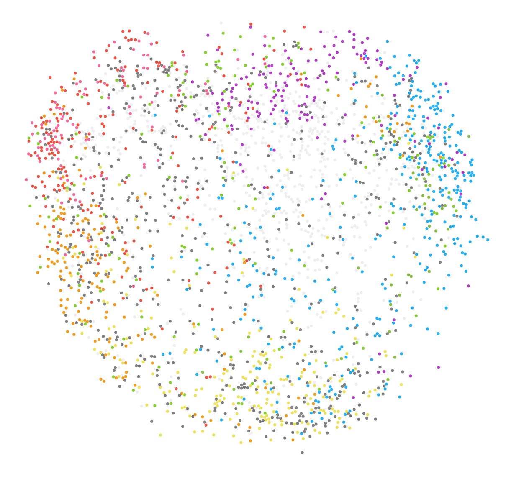
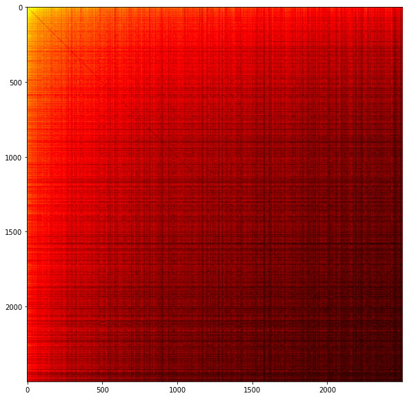

# Mapping Spotify Artists

	
By <a href="https://womogenes.github.io" target="_blank">William Y. Feng</a> and <a href="https://tinyurl.com/ceciliasun" target="_blank">Cecilia Sun</a>

	
<i>View the source code for this project <a href="https://github.com/womogenes/spotify-final" target="_blank">here</a>.</i>

## Introduction

Music streaming service [Spotify](https://www.spotify.com/) transformed music listening when it first launched in 2008, and has since become the go-to method for streaming and listening to new music.
Gone were the days of CDs and cassettes; users could now listen to high-quality music at the touch of a button.

<!---
One of the greatest conveniences Spotify had to offer, however, was the ability to quickly create and add to playlists.
--->

The rise of Spotify and other online streaming servers has fundamentally changed the way we listen to music.
Whereas, in the past, individual songs had to be played as part of a complete album by a singular artist, either on vinyl or, later, via cassette tapes, streaming services have made it easier for listeners to mix-and-match individual songs by different artists to curate and share completely personal and original playlists; in short, playlists have become the default way to listen to music.

The content in Spotify playlists can vary widely.
Some Spotify users group music by genre, such as in this k-pop girl group playlist:

  
<iframe style="border-radius:12px" src="https://open.spotify.com/embed/playlist/2DLAaotcOJPMecaaZtrgtk?utm_source=generator" width="75%" height="152" frameBorder="0" allowfullscreen="" allow="autoplay; clipboard-write; encrypted-media; fullscreen; picture-in-picture" loading="lazy"></iframe>

Others group songs according to a certain set of "vibes", such as in this "chill vibes" playlist:

<iframe style="border-radius:12px" src="https://open.spotify.com/embed/playlist/4PAzvpUoDjE1hsLyYxbxNx?utm_source=generator" width="75%" height="152" frameBorder="0" allowfullscreen="" allow="autoplay; clipboard-write; encrypted-media; fullscreen; picture-in-picture" loading="lazy"></iframe>

Yet others create playlists in order to set the mood for an activity, whether it be a dance party playlist, a workout playlist, or a "soft pop/rock" playlist to "take the edge off" of labor \& delivery (!?):

<iframe style="border-radius:12px" src="https://open.spotify.com/embed/playlist/37i9dQZF1DXe13FP72mxNn?utm_source=generator" width="75%" height="152" frameBorder="0" allowfullscreen="" allow="autoplay; clipboard-write; encrypted-media; fullscreen; picture-in-picture" loading="lazy"></iframe>

Others are silly, such as this user-created playlist that takes you along on an emotional journey making banana bread:

<iframe style="border-radius:12px" src="https://open.spotify.com/embed/playlist/2k9WGCD9GxTUsdYtIDnZhG?utm_source=generator" width="75%" height="152" frameBorder="0" allowfullscreen="" allow="autoplay; clipboard-write; encrypted-media; fullscreen; picture-in-picture" loading="lazy"></iframe>

or this playlist consisting of 343 hours of "Satan's Saxophones":

<iframe style="border-radius:12px" src="https://open.spotify.com/embed/playlist/5YuogqMDKbD8KSXn71MGdt?utm_source=generator" width="75%" height="152" frameBorder="0" allowfullscreen="" allow="autoplay; clipboard-write; encrypted-media; fullscreen; picture-in-picture" loading="lazy"></iframe>

In sum, playlists are generally organized with a central theme in mind. Therefore, tracks on the same user-created playlists can be expected to have some sort of commonality.

## About the Dataset

Spotify's [Million Playlist Dataset](https://www.aicrowd.com/challenges/spotify-million-playlist-dataset-challenge) contains a million user-created Spotify playlists from between January 2010 and October 2017.

On average, playlists contain 66 tracks from 38 distinct artists and 50 different albums.
Here's a visualization of the distribution of playlist length across all the playlists:

And a visualization of the number of distinct artists represented per playlist:

Both distributions have a right skew, but more curiously they are not normal distributions but rather decrease exponentially in frequency for greater numbers of artists and tracks.

## Artist Interactions

Across the one million playlists, there are a total of 287742 artists represented.
For our analysis, however, we decided to focus on the top 2500 artists as determined by the number of occurrences of any of their songs across all playlists.

We were interested in the concept of "artist proximity" -- in other words, how often two artists appeared in user-created playlists together.
To rigorize this concept, we defined the "Artist Interaction Score" (AIS) between two artists to be

$$
	\operatorname{AIS}(A,B) = \ln\left(\sum_{p\text{ in playlists}}(\text{no. tracks by }A\text{ in }p)(\text{no. tracks by }B\text{ in }p)\right).
$$

In other words, the more times two artists both have many songs in the same playlist, the higher their Artist Interaction Score will be.

We then created a 2500 by 2500 matrix containing artist interaction scores for each of the 6250000 ordered pairs of artists. After ordering the rows and columns in order of artist popularity and coloring cells by value (darker cells correspond to higher values)

It makes sense that the highest values occur towards the top and the left of the matrix, since artists are sorted with respect to metrics of playlist inclusion and, broadly speaking, the total artist interaction score increases the more an artist is included in a playlist.
however, the fact that the top left corner still contains the highest values indicates that popular artists are still more frequently put in playlists with other popular artists. 

## PCA (Principal Component Analysis)

Principal Component Analysis (PCA) is a technique for analyzing and visualizing high-dimensional data, such as our artist interaction matrix. 
Broadly speaking, the method attempts to increase data interprability by reducing the number of dimensions (usually to just 2 dimensions) while still preserving as much information as possible.

<!---
### Some Technical Mathematical Details
For those who are familiar with linear algebra: 
--->

## Limitations of our Analysis
One limitation of our analysis is that defines its metrics of artist popularity and artist interaction through user-created *playlists*. This creates certain genres of music that are potentially underrepresented within the data: for instance, 
songs from genres such as "album rock" are better listened to in the context of other songs from that album, while songs in more recently-released albums are more frequently written with playlist inclusion in mind: these songs are potentially overrepresented in our data. 
It is difficult, however, to know for sure how severely these issues are manifested in our data and analysis because of the difficulty of finding objective measures of the already-vague notions of "artist popularity" and "artist interactions" and due to the sheer size of the data. 

Another limitation of our analysis comes from the limitations of PCA itself. 
Our implementation of PCA projects high-dimension data onto a two-dimensional grid and does really well at grouping "similar" artist together, but the actual interpretation of the axes on the PCA map as a whole is unclear.

## The PCA Map
Finally, we get to the PCA map of the top 2500 artists. 

### A note on artist colors
To assign artist colors by genre, we created a list of broad genres that would have their own individual colors. We used the Spotify API to generate a list of raw genres for each artist, then used a substring search to categorize these raw genres into the broad genres. 

In the case where artists had two or more raw genre tags that fell under different broad genres, we colored their associated data point with the color of the genre that came first alphabetically, which creates a slight bias in the colors; however, given the size of the data it would have been difficult to assign genres manually. 

## The Map Itself
Here's the PCA map of the top 2500 artists in its entirety, with artists colored by genre. 

In the top left, we have a pretty large hip hop/rap cluster, with artists such as [Flo Rida](https://open.spotify.com/artist/0jnsk9HBra6NMjO2oANoPY?si=lkDbL7SJTPCJklXDS4ItdA), [T-Pain](https://open.spotify.com/artist/3aQeKQSyrW4qWr35idm0cy?si=9c2193f36485433a), and [Eminem](https://open.spotify.com/artist/7dGJo4pcD2V6oG8kP0tJRR?si=84d98b28f7394aa2) located at the top part of the cluster. 

As we move down the hip hop/rap cluster, we start seeing some more EDM and dance pop-adjacent artists such as [Major Lazer](https://open.spotify.com/artist/738wLrAtLtCtFOLvQBXOXp?si=ddf755075e9e4cb6), [Zedd](https://open.spotify.com/artist/2qxJFvFYMEDqd7ui6kSAcq?si=9a1ebfa86f074dcd), and [Marshmello](https://open.spotify.com/artist/64KEffDW9EtZ1y2vBYgq8T?si=6788719bdb9b4418). 

At the bottom of the graph is the "indie" cluster. The indie cluster features artists in the alternative rock genre, such as [Arctic Monkeys](https://open.spotify.com/artist/7Ln80lUS6He07XvHI8qqHH?si=ed03115dfb1f4c40) and [Radiohead](https://open.spotify.com/artist/4Z8W4fKeB5YxbusRsdQVPb?si=0cb8183bf614459b), dreampop, indietronica, and shoegaze artists such as [Glass Animals](https://open.spotify.com/artist/4yvcSjfu4PC0CYQyLy4wSq?si=948616adeb7d4533), and folk and indie pop artists such as [Bon Iver](https://open.spotify.com/artist/4LEiUm1SRbFMgfqnQTwUbQ?si=4d43a97ee2df45e0). It's generally characterized by a slower, guitar-heavy, and sometimes even dreamy sound. 

The right side of the map contains a very large and broad rock cluster. Rock is a generally diverse genre, which is reflected in its breadth on the PCA map.

<!--- 
annotate rock cluster image
--->

Towards the bottom of the rock cluster are artists that fall under the "art rock" genre such as <nobr>[David Bowie](https://open.spotify.com/artist/0oSGxfWSnnOXhD2fKuz2Gy?si=f1b417283ce0447a)</nobr>, [Pink Floyd](https://open.spotify.com/artist/0k17h0D3J5VfsdmQ1iZtE9?si=009e85d058024275), and [The Beatles](https://open.spotify.com/artist/3WrFJ7ztbogyGnTHbHJFl2?si=761ce088be954cfb).
Like the indie cluster below and to the left of this sub-cluster, these artists have a more mellow and soft rock sound.

A bit to the left of the art rock sub-cluster, closer to the center, are artists in the rock genre that are more alternative and funk rock-adjacent, with artists such as [Red Hot Chili Peppers](https://open.spotify.com/artist/0L8ExT028jH3ddEcZwqJJ5?si=842d841ee4d249c4), [Weezer](https://open.spotify.com/artist/3jOstUTkEu2JkjvRdBA5Gu?si=df624abe227140e9), and [Nirvana](https://open.spotify.com/artist/6olE6TJLqED3rqDCT0FyPh?si=a5aa362099194aac). 

A bit higher up are punk rock, skate punk, and grunge artists, such as [Green Day](https://open.spotify.com/artist/7oPftvlwr6VrsViSDV7fJY?si=ed2e4dfd77da45e3) and [My Chemical Romance](https://open.spotify.com/artist/7FBcuc1gsnv6Y1nwFtNRCb?si=0db25d5cf3514617).  

To the right of these artists are classic rock and album rock artists such as [Queen](https://open.spotify.com/artist/1dfeR4HaWDbWqFHLkxsg1d?si=9e2f63cf38bd4de5), [The Rolling Stones](https://open.spotify.com/artist/22bE4uQ6baNwSHPVcDxLCe?si=6e220afdc038442d), and the [Eagles](https://open.spotify.com/artist/0ECwFtbIWEVNwjlrfc6xoL?si=2cbae0e4ad7f47d2). 

Finally, the top of the rock cluster contains metal-adjacent rock artists such as [AC/DC](https://open.spotify.com/artist/711MCceyCBcFnzjGY4Q7Un?si=48431d271987429f), [Guns N' Roses](https://open.spotify.com/artist/3qm84nBOXUEQ2vnTfUTTFC?si=b95beca26c424928), and [Metallica](https://open.spotify.com/artist/2ye2Wgw4gimLv2eAKyk1NB?si=0cce223b75354f88).

Along the top of the graph, next to the rock cluster, is a small country featuring artists such as [Carrie Underwood](https://open.spotify.com/artist/4xFUf1FHVy696Q1JQZMTRj?si=babdc16fb18f491b) and [Blake Shelton](https://open.spotify.com/artist/1UTPBmNbXNTittyMJrNkvw?si=60f43f5fd9414b0f). There are also many artists who produce Christian music located in that cluster. 

Finally, artists considered "pop" are scattered all around the map. This likely comes from the fact that "pop" is a pretty generic tag, and encompasses a wide range of musical sounds. 
Furthermore, many of the genres for which we already have classifications have an associated "pop" version of that genre, so that pop has become a sort of default genre assignment under our genre assignment scheme for some artists.

## Interactive PCA map 

Finally, here is the interactive PCA map in all its glory. 
